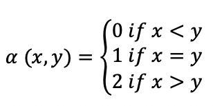

# Gamma Classifier
Mexican classifier applied to the Iris Dataset


As a member of the Alfa-Beta research group, I transform the theory of Gamma classifier into  Python 3.0 code. 

Gamma is a classifier that has shown to be competitive in classification and prediction task. The primary operators of the Gamma classifier are:

* Gamma hybrid (based on alpha and beta operators)

* Unary 

The non-tabular definition of the alpha operator is defined by:



The non-tabular definition of the beta operator is defined by:


The gamma hybrid operator is defined by:


The unary operator is defined by: 


##Gamma Framework v1.0
* Read Iris Dataset:
```python
X=Gamma().read_dataset(website='UCI_Machine_Learning_Repository', dataset='iris')
```
* Separate data and labels:
```python
X, y = Gamma().separate_data_and_labels(X)
```
* Comprobate if the dataset has missing values:
```python
Gamma().detect_missing_values(X, y)
```
* Know the total patterns of the dataset:
```python
Gamma().total_patterns(X)
```
* Apply the logarithmic scale (Pre-processing stept for Gamma):
```python
X = Gamma.logarithmic_scale(X, exponent=0)
```
* Feature correlation:
```python
Gamma().feature_correlation(X)
```
* Hold-Out Stratified:
```python
X_train, X_valid, y_train, y_valid = Gamma().hold_out_stratified(X, y, train_size=0.7, test_size=0.3)
```
* Get patterns by class:
```python
test_class_1, test_class_2, test_class_3 = Gamma().get_patterns_by_class(y_valid, X_valid)
```
* Get the number of patterns by class:
```python
class1_n, class2_n, class3_n = Gamma().get_number_of_patterns_by_class(y_train)
```
* Prepare data:
```python
train_patterns, X_test, number_of_patterns = Gamma().prepare_data(class1_n,
                                                        patterns_c1,  
                                                        class2_n, 
                                                        patterns_c2,
                                                        class3_n, 
                                                        patterns_c3,
                                                        X_valid, 
                                                        y_valid)
data  = {'X_test':X_test,'train_patterns':train_patterns, 'number_of_patterns':number_of_patterns, 'theta':5}    
```
* Classification:
```python
acc, preds = Gamma().predict(**data)                    
```
* Confusion Matrix:
```python
Gamma().plot_confusion_matrix(preds, y_valid, names)
```
* Mean absolute error (mae):
```python
Gamma().mean_absolute_error(preds, y_valid)
```

References:

[1]I. López-Yáñez, A. J. Argüelles-Cruz, O. Camacho-Nieto, and C. Yáñez-Márquez, “Pollutants Time-Series Prediction using the Gamma Classifier,” International Journal of Computational Intelligence Systems, vol. 4, no. 4, pp. 680–711, Jun. 2011.

[2]C. Yáñez-Márquez, I. López-Yáñez, M. Aldape-Pérez, O. Camacho-Nieto, A. J. Argüelles-Cruz, and Y. Villuendas-Rey, “Theoretical Foundations for the Alpha-Beta Associative Memories: 10 Years of Derived Extensions, Models, and Applications,” Neural Processing Letters, vol. 48, no. 2, pp. 811–847, Oct. 2018.


